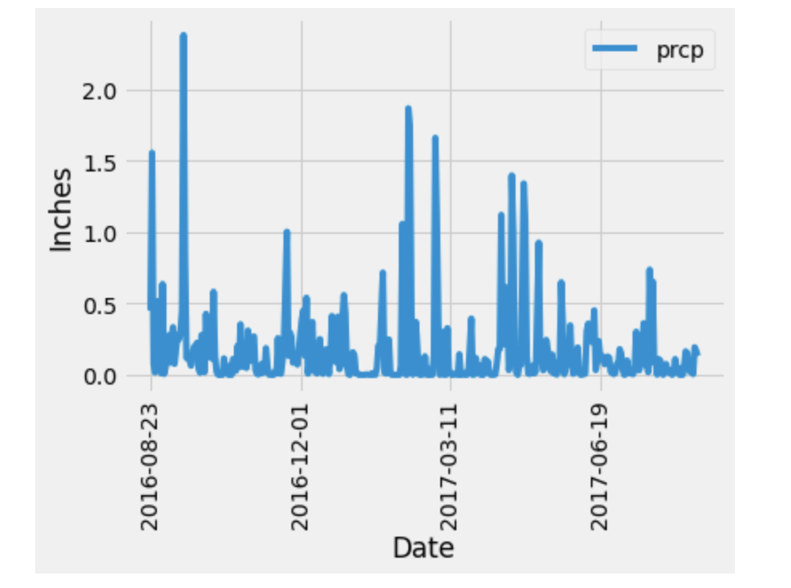
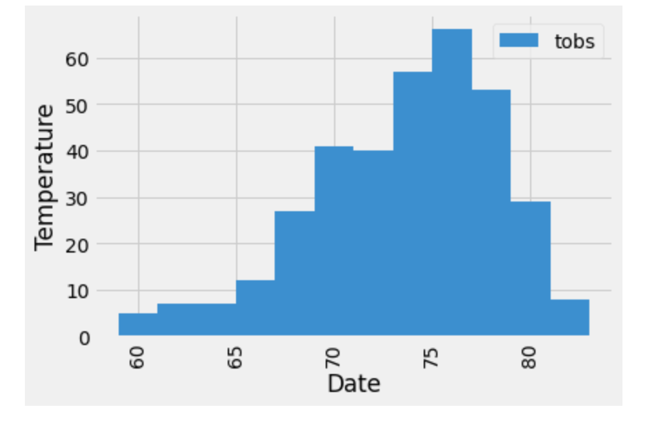

# SQLAlchemy Challenge
> In this project, I analyzed and explored climate data for Honolulu, Hawaii using SQLAlchemy ORM queries, Pandas, and Matplotlib

## Precipitation Analysis
* First, I analyzed the last 12 months of the dataset using a query retrieving date and precipitation values. Because there was more than one precipitation entry per date, I calculated the average precipitation value for each date.
* Next, I loaded the query results into a Pandas Dataframe and plotted the data. I also printed the summary statistics for the precipitation data.

## Station Analysis
* First, I calculated the total number of stations.
* Next, I queried all the stations, their observation counts, and ordered them (descending). I found that the most active station was USC00519281, with 2772 observations.
* Then, I created a histogram for the most active station over the course of 12 months 

## Climate App
* I created a Flask API based on the queries developed in Jupyter notebook
* To run the app, run `python app.py` in your terminal, and then copy and paste the link into your browser to open the app
